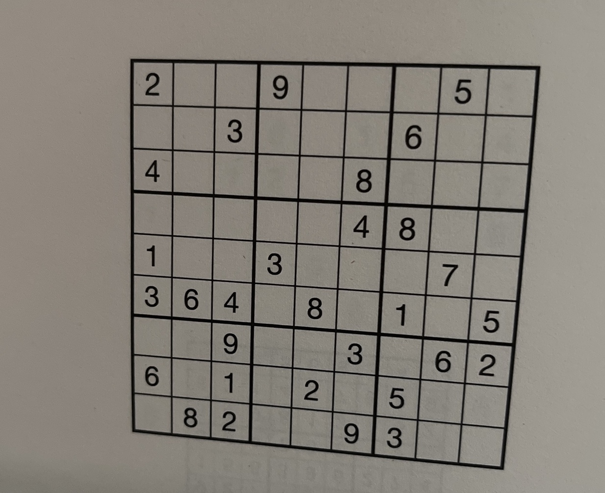

# SudokuSensei

A simple Sudoku solver implemented with PyTorch and OpenCV.
Currently using a brute-force backtracking algorithm.

## To Do
  - implement different solving algorithms
  - display solution as overlay on original input image
  
## Example
  We have as input the following picture of a Sudoku that has not been started:
  
  
 Output:
 ```
 Solving Sudoku:


[2. 0. 0.]   [9. 0. 0.]   [0. 5. 0.]
[0. 0. 3.]   [0. 0. 0.]   [6. 0. 0.]
[4. 0. 0.]   [0. 0. 8.]   [0. 0. 0.]


[0. 0. 0.]   [0. 0. 4.]   [8. 0. 0.]
[1. 0. 0.]   [3. 0. 0.]   [0. 7. 0.]
[3. 6. 4.]   [0. 8. 0.]   [1. 0. 5.]


[0. 0. 9.]   [0. 0. 3.]   [0. 6. 2.]
[6. 0. 1.]   [0. 2. 0.]   [5. 0. 0.]
[0. 8. 2.]   [0. 0. 9.]   [3. 0. 0.]

Solved Sudoku in 1.25 seconds.

Solution:


[2. 7. 6.]   [9. 3. 1.]   [4. 5. 8.]
[8. 9. 3.]   [2. 4. 5.]   [6. 1. 7.]
[4. 1. 5.]   [6. 7. 8.]   [9. 2. 3.]


[9. 2. 7.]   [1. 5. 4.]   [8. 3. 6.]
[1. 5. 8.]   [3. 9. 6.]   [2. 7. 4.]
[3. 6. 4.]   [7. 8. 2.]   [1. 9. 5.]


[5. 4. 9.]   [8. 1. 3.]   [7. 6. 2.]
[6. 3. 1.]   [4. 2. 7.]   [5. 8. 9.]
[7. 8. 2.]   [5. 6. 9.]   [3. 4. 1.]
   ```
   
## How it works
The input image is processed via the cv2 library. It is converted to grayscale and then crushed using adaptive threshold.
Afterwards it is cropped and perspective-warped to a square.

Cells are extruded using their contours and non-empty cells are evaluated using a custom trained neural net. The dataset was kindly provided by [@kaydee0502](https://github.com/kaydee0502) on [Kaggle](https://www.kaggle.com/datasets/kshitijdhama/printed-digits-dataset). 

